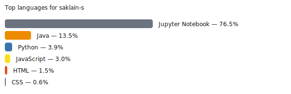

<h1 align="center">Hi there! I'm Saklain</h1>

  

I'm a self-taught, passionate developer from India 🇮🇳

**Final-year B.Tech student with strong proficiency in backend systems engineering, specializing in Java, Spring Boot, and microservices architectures. Experienced in designing, building, and deploying scalable RESTful APIs for high-performance applications. Passionate about leveraging cloud technologies (AWS, Docker) and CI/CD pipelines to deliver robust, production-grade solutions, with a strong commitment to continuous skill growth in modern software engineering.**

  
  
  
  
  

  
  
  
  

- 🔭 I’m currently open to a new Job

- 📫 Reach me at: shaiksaklain04@gmail.com
- 🚀 Currently building REST APIs
- 🧑‍💻 Exploring new technologies and frameworks
- 💡 I love solving real-world problems with code
- 📄 View My Resume ->: 

### Connect with me

  
  <a href="https://leetcode.com/u/Saklain_4/" target="blank" style="margin-right:12px; display:inline-flex; align-items:center; height:30px;"></a>
  

Languages and Tools

<ul>
  <li><strong>Backend</strong>
    

      
      
      
    

  </li>
  <li><strong>Database</strong>
    

      
      
    

  </li>
  <li><strong>Cloud</strong>
    

      
    

  </li>
  <li><strong>Tools</strong>
    

      
      
      
      
      
      
    

  </li>
</ul>

### Most Used Languages

### Top Repositories

   

